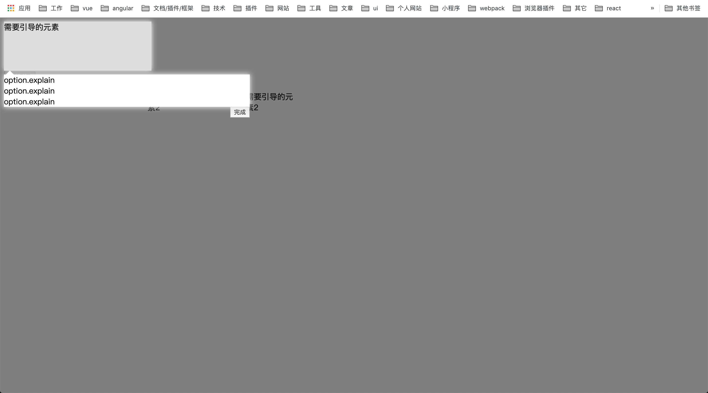

参数  | 说明 | 类型 | 默认值 | 是否必填 | 备注
---- |----- | ----|------ | ------- | ----
el   | 用来选择需要引导的元素 | id/Element | 无 | 是 | 
width | 露出空白的宽度 | Number | 需要引导元素的宽度 | 否 | 
height | 露出空白的高度 | Number | 需要引导元素的高度 | 否 | 
top | 空白为距离窗口顶部的高度 | Number | 需要引导元素的位置 | 否 | 
left | 空白为距离窗口左边的距离 | Number | 需要引导元素的位置 | 否 |  
explainWidth | 文字说明位置的宽度 | Number | 需要引导元素的宽度 | 否 |  当说明的内容很多，比需要引导的元素宽是可以使用该字段
selfClickCallback | 点击被引导元素的回调 | Function | function(){} | 否 |
nextCallback | 点击下一步的回调 | Function | function(){} | 否 |
closeCallback | 点击跳过的回调 | Function | function(){} | 否 |
nextBtnText | 下一步按钮的文字 | String | 下一步 | 否 |
closeBtnText | 跳过按钮的文字 | String | 跳过 | 否 |
showNext | 是否现实下一步按钮 | Boolean | true | 否 |
showClose | 是否现实跳过按钮 | Boolean | false | 否 |
explain | 其他说明内容 | String或者Element | null | 否 |

github：https://github.com/ZNN-She/maskGuide
演示地址：http://znnsnake.com:8090/demo/mask-guide/
npm：https://www.npmjs.com/package/mask-guide
