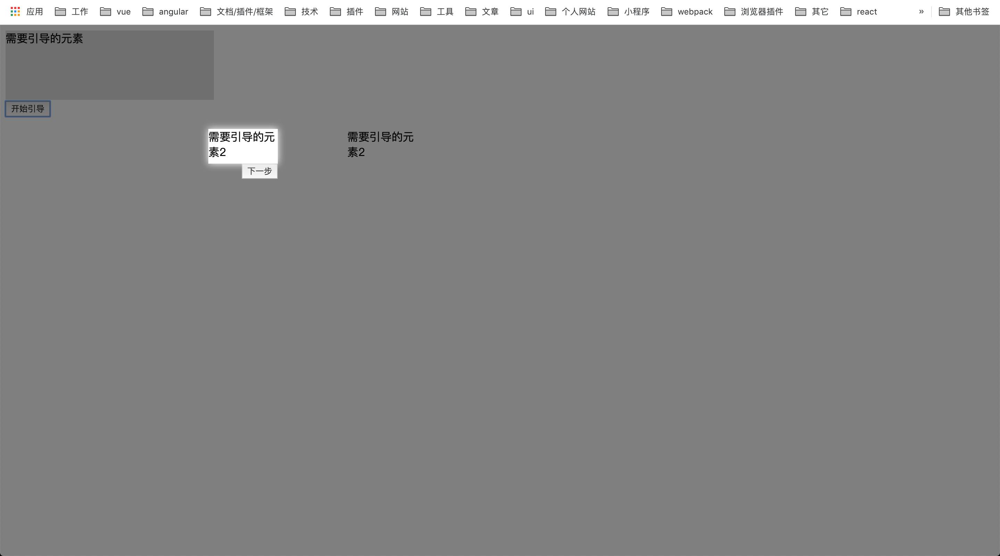
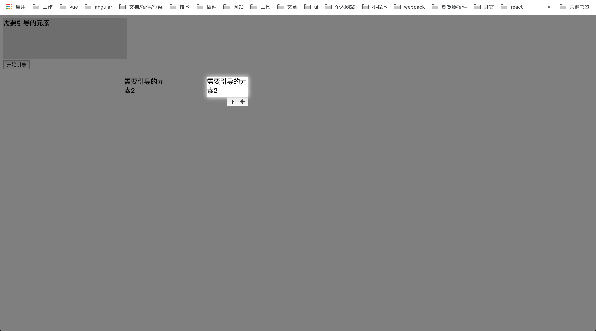

#介绍
功能遮罩引导

#使用
```
import {guide, close} from "mask-guide";

guide({
    el: "2",
    type: "step",
    position: "bottomRight",
    onClickNext: () => {
        console.log("点击了下一步");
        close();
    }
    explain: {
        title: "这是title",
        content: "这是内容这是内容这是内容这是内容这是内容这是内容"
    }
});
```
```
<script src="mode_moudules/mask-guide/dist/index.js"></script>
maskGuide.guide({
    el: "2",
    type: "step",
    position: "bottomRight",
    onClickNext: () => {
        console.log("点击了下一步");
        maskGuide.close();
    }
    explain: {
        title: "这是title",
        content: "这是内容这是内容这是内容这是内容这是内容这是内容"
    }
});
```

#效果



#API


参数  | 说明 | 类型 | 默认值 | 是否必填 | 备注
---- |----- | ----|------ | ------- | ----
el   | 需要引导的元素 | id/Element | 无 | 是 | 
type   | 引导类型 | String | step | 否 | 
classWarp |  | String | 无 | 否 | 
position | 方向 | String | bottom | top/left/right/bottom/topLeft/topRight/bottomLeft/bottomRight/leftTop/leftBottom/rightTop/rightBottom | 
targetPosition | 引导位置 | Object | 无 | 否 | {top: 100, left: 100}
targetSize | 引导空白未知的大小 | Object | 无 | 否 | {width: 100, height: 100}
onClickTarget | 点击target元素触发 | Function | 无 | 否 |
onClickNext | 点击下一步触发 | Function | 无 | 否 | 
onClickPrev | 点击上一步触发 | Function | 无 | 否 | 
onClickClose | 关闭触发 | Function | 无 | 否 | 
nextBtnText | 下一步按钮文字 | String | 下一步 | 否 | 
prevBtnText | 上一步按钮文字 | String | 上一步 | 否 | 
showNext | 是否显示下一步按钮 | Boolean | true | 否 | 
showPrev | 是否显示上一步按钮 | Boolean | true | 否 | 
showClose | 是否显示关闭按钮 | Boolean | true | 否 | 
showArrow | 是否显示箭头 | Boolean | true | 否 | 
showStar | 是否显示星星 | Boolean | true | 否 | 只在active有效，step没有星星
maskClosable | 点击蒙层是否允许关闭	 | Boolean | true | 否 | 
explain | 说明modal | Object/Boolean | { width: 340 } | 否 | false的时候不显示


explain


参数  | 说明 | 类型 | 默认值 | 是否必填 | 备注
---- |----- | ----|------ | ------- | ----
width |  | Number | { width: 340 } | 否 | 
title |  | String/Element | 无 | 否 | 
content |  | String/Element | 无 | 否 | 

#升级日志
* 增加点击点击蒙层是否允许关闭控制

